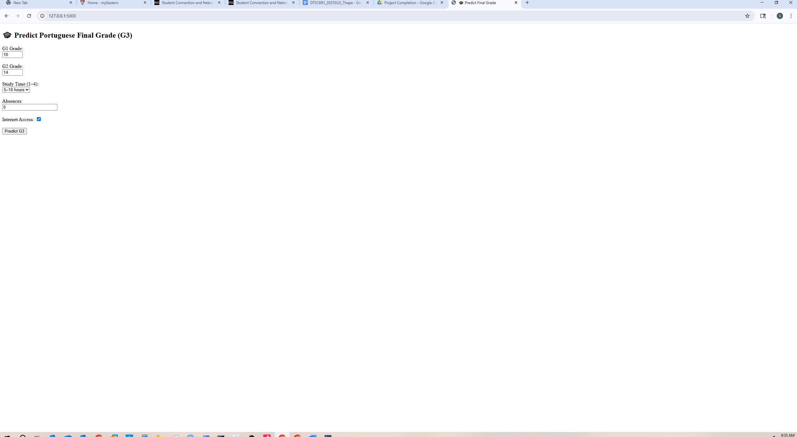

# 👋 Hi, I'm Goitom Abirha  
🎓 MSc in Data Science | 💻 Machine Learning & AI Engineer | 🌍 Passionate about building AI-powered creative systems  

---

## 🧠 About Me  
- 🎓 Completed **MSc in Data Science ** from Eastern University  
- 🧩 Focus: Machine Learning, Flask, Data Visualization, and AI-driven design systems  
- 🚀 I love turning data into insights and building intelligent, user-friendly applications  
- 🎨 Inspired by Figma’s mission — I design systems that blend **AI + creativity + collaboration**

---

## 🧰 Tech Stack  

---

## 📂 Featured Projects  

### 🎓 Student Performance Prediction App  
A Flask-based ML web app predicting student grades using linear models and SVM.  
📊 *Includes SHAP explainability visuals and Azure SQL integration.*

---

### 🧠 AI Developer Assistant (Prototype)  
Flask + LLM-powered tool that provides smart coding and design feedback — bridging creativity and AI.  
🧩 *Inspired by Figma’s AI-assisted workflow vision.*

---

### 🌍 CIFAR-10 Image Classifier  
CNN-based image recognition model achieving **92% accuracy** using Keras.  
📸 *Focus: explainability and visual interaction.*

---

### 📊 Mushroom Classifier  
A TensorFlow neural network predicting edible vs. poisonous mushrooms.  
🍄 *Includes PCA dimensionality reduction and interactive charts.*

---

## 📫 Connect with Me  

