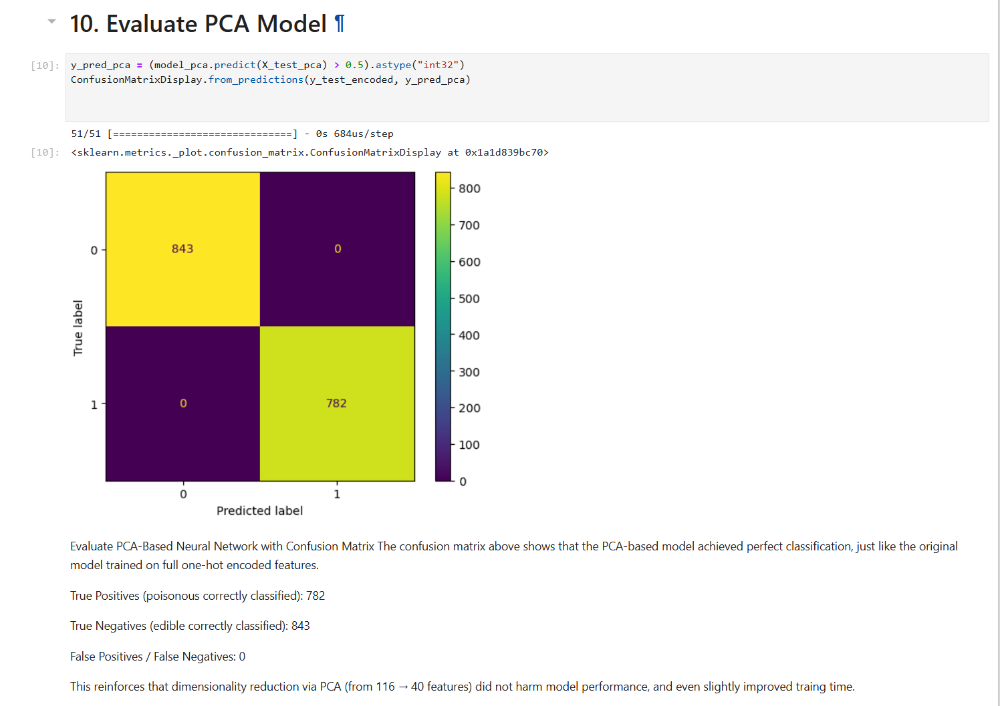

# 👋 Hi, I'm Goitom Abirha  

🎓 MSc in Data Science | 💻 Data Scientist | 🤖 Machine Learning Engineer  
📊 Predictive Modeling • Risk Analytics • Explainable AI  

🚀 I build **end-to-end machine learning systems** that turn complex data into **real-world decisions and business impact**.

---

## ⚡ Quick Highlights  

- 🧠 Built **LSTM/GRU models** for time-series prediction (RUL forecasting)  
- 📉 Developed **risk scoring systems** for decision-making  
- 💡 Applied **Explainable AI (SHAP)** for model transparency  
- 🌐 Deployed **interactive ML apps** (Flask, Streamlit)  
- ☁️ Integrated **Azure SQL + analytics pipelines**  

---

## 🧰 Tech Stack  

**Languages:** Python, SQL, Java, C++  
**ML/AI:** TensorFlow, Keras, Scikit-learn, SHAP  
**Data:** Pandas, NumPy, Matplotlib, Seaborn  
**Deployment:** Flask, Streamlit  
**Cloud & DB:** Azure SQL  
**Tools:** Git, Tableau, Jupyter, VS Code  

---

## 🚀 Featured Projects  

### ✈️ Aircraft Engine Predictive Maintenance  
🔹 Time-series ML system using LSTM/GRU to predict Remaining Useful Life (RUL)  

💡 Impact:  
- Enables **early failure detection**  
- Supports **risk reduction & maintenance optimization**  

🛠 TensorFlow • Streamlit • Time-Series  

---

### ✈️ Aircraft Engine Safety Risk Prediction  
🔹 Risk classification system (Low / Medium / High) for operational decision-making  

💡 Impact:  
- Improves **safety monitoring & prioritization**  
- Supports **data-driven decisions**  

---

### 💳 Fraud Detection Assistant (LLM + ML)  
🔹 AI-powered system detecting suspicious financial transactions  

💡 Impact:  
- Reduces **financial risk**  
- Provides **explainable insights**  

---

### 🎓 Student Performance Prediction (Explainable AI)  
🔹 Flask-based ML app with SHAP explainability  

💡 Impact:  
- Improves **model transparency & trust**  

---

### 🌍 Image Classification (CNN – 92% Accuracy)  
🔹 Deep learning model for image recognition  

💡 Impact:  
- Demonstrates **strong deep learning capability**  

---

### 📊 Neural Network + PCA Classification  
🔹 Optimized model with dimensionality reduction  

💡 Impact:  
- Improves **efficiency & performance**  

---

## 📈 What Makes Me Different  

✔️ I don’t just build models — I build **decision systems**  
✔️ I focus on **real-world impact, not just accuracy**  
✔️ I combine **ML + explainability + deployment**  

---

## 📫 Connect With Me  

  

💼 Open to:  
**Data Science | Machine Learning | Risk Analytics | AI Engineering**
